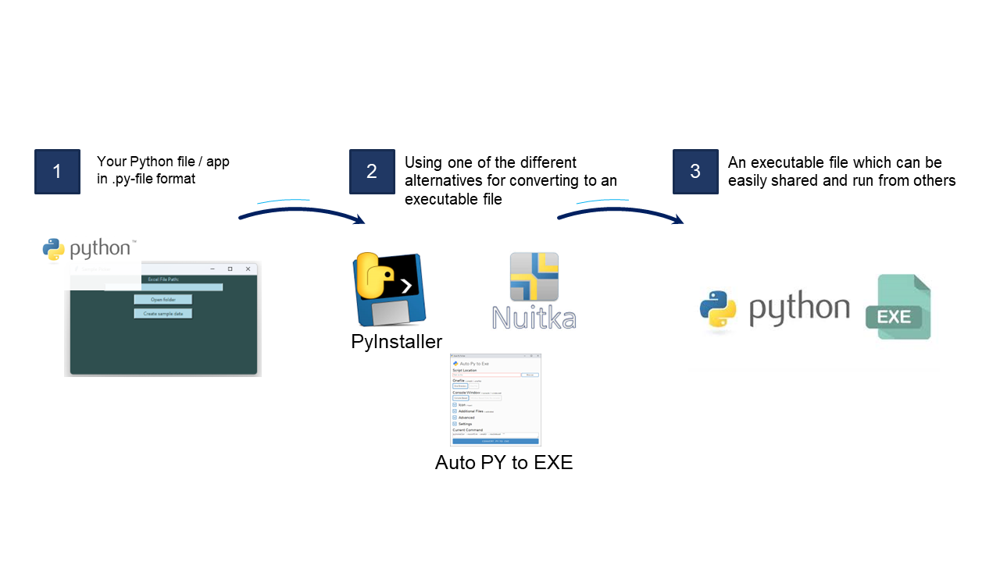

# python-to-exe Use Case description
A simple use case detailing how to easily convert your Python file to an executable file

This repository contains a simple Python application that prompts the user to enter their name and greets them with a message.
Besides the choosen popular approach of using PyInstaller, it is also worth checking the two other options Nuitka and Py2exe or get familiar with other options.

To get started, you'll need to install PyInstaller, a popular tool for converting Python scripts into standalone executables. Follow these steps:

1. **Install PyInstaller**: Open your terminal or command prompt and run the following command to install PyInstaller via pip:

```
pip install pyinstaller
```


For more information about PyInstaller, you can visit the [PyInstaller website](https://pyinstaller.org/en/stable/).


2. **Navigate to the Directory**: Once PyInstaller is installed, you can navigate to the directory containing your Python script or use the provided example in the src folder of this repo. For example:

```
cd /path/to/your/python/script
```

3. **Convert Python Script to Executable**: Run the following command to convert your Python script into an executable:

```
pyinstaller --onefile your_script.py
```

Replace `your_script.py` with the name of your Python script. The `--onefile` option creates a single executable file instead of multiple files.

4. **Run the Executable**: After PyInstaller finishes, you'll find the generated executable file in the `dist` directory. You can run this executable like any other program.


## Additional options to convert your py-files to exe-files

Besides PyInstaller, you can explore other options for converting Python scripts into standalone executables:

- **Nuitka**: Nuitka is a Python compiler that converts Python code into optimized C code, generating standalone executables without requiring a Python interpreter. For more information, visit the [Nuitka website](https://nuitka.net/).

- **Py2exe**: Py2exe is a Python extension specifically designed for Windows platforms, converting Python scripts into Windows executable files (`.exe`) that can bundle Python interpreters. For more information, visit the [Py2exe project page](https://pypi.org/project/auto-py-to-exe/).


Feel free to explore these options based on your specific requirements and preferences.


## License

This project is licensed under the [MIT License](LICENSE).





